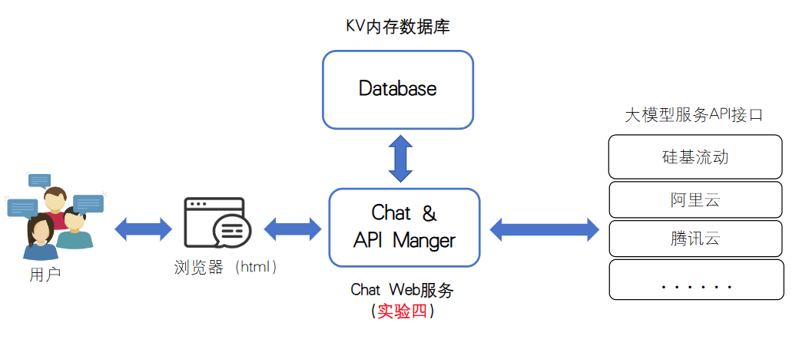
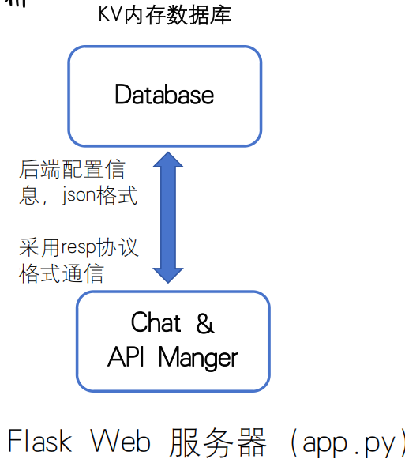
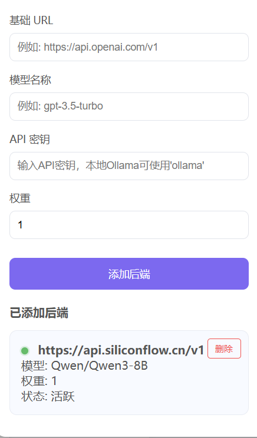
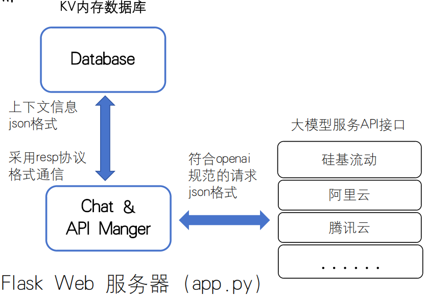
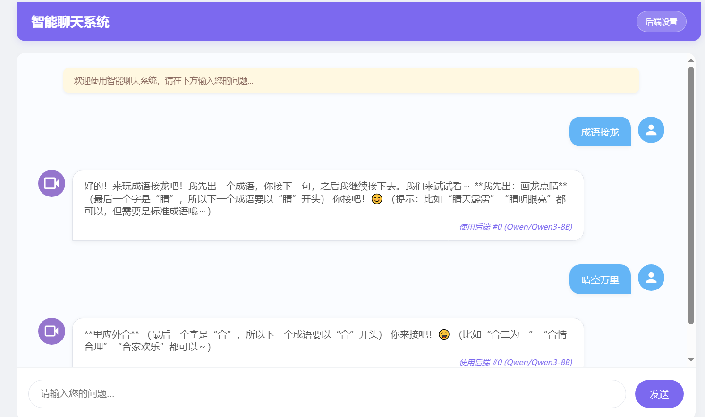

# 实验 4：基于Web的聊天系统

## 1. 系统概述

在 Lab 2 中，我们完成了一个简化的 HTTP/1.1 Web 服务器；

在 Lab 3 中，我们完成了一个简化的 分布式数据库系统。

现在让我们尝试将两者组合并完善，开发一个基于Web的聊天系统，能够连接并管理多个大型语言模型(LLM)后端，提供统一的用户聊天界面。系统应支持负载均衡和故障转移，确保服务的高可用性和稳定性。

**任务点：补充代码**

```
文件目录：Lab4\modules\backend_manager.py

def get_available_backend():
    """
    选择一个可用后端（可用于负载均衡）
    
    返回:
        dict: 选择的后端信息，包含backend_id字段
    """
    #lab4_Job:请补充代码，实现自己的算法选择一个后端返回
    
    
```

## 2. 核心功能需求

整体代码框架如下图所示：



### 2.1 多后端管理

需求：

- 支持添加、删除和管理多个LLM后端服务（如OpenAI等），对应的http请求为：
  1. 添加大模型后端 **POST /api/backends**
  2. 删除大模型后端 **DELETE /api/backends**
  3. 加载大模型后端配置信息 **GET /api/backends**
- 提供Web界面进行后端服务的配置管理

多后端管理在所提供代码中的实现：

* 实现**/api/backends**的代码为backend_api.py

* 后端管理界面在'templates/chat.html'中实现

* **/api/backends**的业务逻辑在modules\backend_manager.py中实现。需要选择一个大模型后端（**这里也是需要大家补全代码的地方**）。同时将所获得的后端配置信息存入数据库，如下图所示。



示例的后端管理界面如下图所示：



### 2.2 聊天功能

需求:

- 提供Web界面支持文本输入和回复显示
- 保持对话上下文，确保多轮对话的连贯性
- 支持长对话历史的智能截断，避免超出模型上下文限制

聊天功能在所提供代码中的实现：

* 对应的http请求为：**POST /chat**（发送用户输入）

* **Flask API**：/chat的实现为chat_api.py

* modules\chat_history.py实现获取历史上下文，modules\llm_client.py实现发送请求给后端大模型。



示例的聊天界面如下图所示：



### 2.3 负载均衡与高可用（任务点）

需求:

- 实现多后端间的请求分发机制
- 支持后端故障转移，当一个后端失败时自动使用其他后端

代码实现：在modules\backend_manager.py的get_available_backend()函数中补全代码。

## 3. 技术要求

- 前端：基于HTML/CSS/JavaScript的响应式Web界面
- 后端：可使用成熟框架开发Web服务
- 通信：需要支持OpenAI兼容的API格式
- 存储：使用实验三开发的分布式键值存储系统保存后端信息和聊天历史

## 4. 性能要求

- 支持多用户并发

## 5.提交要求

1. 补全指定位置代码
2. 在Lab4文件夹（而不是Lab4的子文件夹下！）下必须有一个文件名为“小组名称+Lab4报告“的文件，此文件内需有要求的两个截图：①截取成语接龙的对话页面，②后端管理（需要至少配置有一个后端）的界面。  
   实验报告放相应截图就可以（必要），也可以把自己的一些实现的思考过程以及有价值的点写上去（非必要）。

## 6.评分标准

- 完成所有要求，你将获得 10 分。
- 如果你有部分功能没有实现，将根据你的完成情况进行细化打分。

